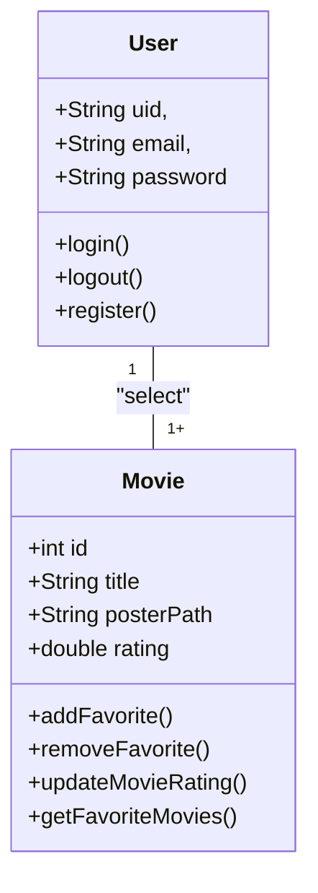
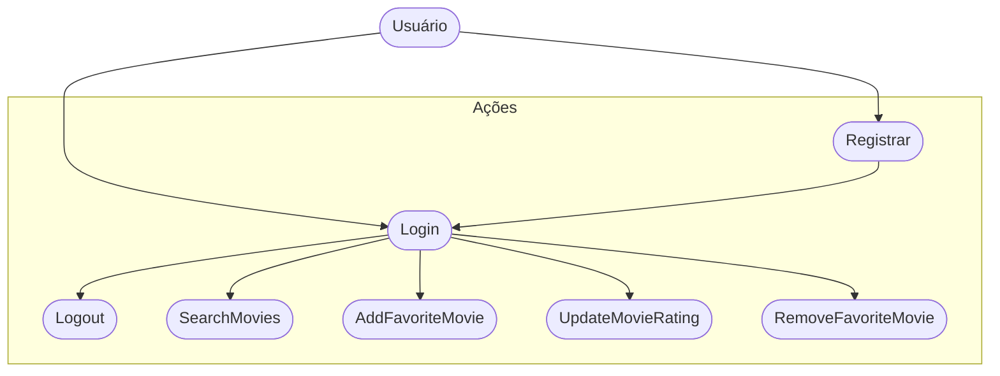
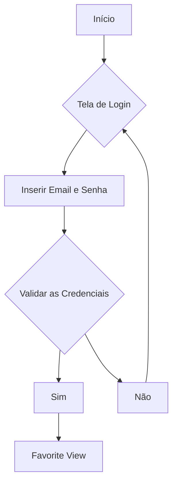

# CineFavorite (Formativa)

## Briefing
Construir um Aplicativo do Zero - O CineFavorite que permitirá criar uma conte e buscar filmes em uma API, montar uma galeria pessoal de filmes favoritos, com poster(capa) e nota avaliativa do usuário para o filme.

## Objetivos
- Criar uma Galeria Personalizada por Usuário de Filmes Favoritos
- Buscar Filmes em uma API e Listar para selecionar filmes favoritos
- Criação de Contas por Usuário
- Listar filmes por Palavra-Chave

## Levantamento de Requistos
- ### Funcionais - (São as funções principais que o aplicativo precisa ter)
Usuário:
- O app deve permitir que o usuário crie uma conta com email e senha.
- O app deve permitir que o usuário faça login e também logout.

Filmes:
- O app deve permitir que o usuário pesquise filmes na API TMDB usando palavra-chave.
- O app deve mostrar os resultados da pesquisa com título e capa (pôster).

Favoritos:
- O usuário deve poder adicionar filmes da lista aos favoritos.
- O usuário deve poder remover filmes dos favoritos.
- O usuário deve poder ver sua lista de filmes favoritos em uma galeria.
- O usuário deve poder dar uma nota para cada filme favorito.
- O usuário deve poder editar/atualizar a nota de um filme já adicionado.

Integrações:
- O app deve se conectar à API TMDB para buscar filmes.
- O app deve usar o Firebase (Auth e Firestore) para salvar contas e a lista de favoritos.

- ### Não Funcionais - (São características de qualidade do aplicativo)

Usabilidade:
- O app deve ter uma interface simples, fácil de usar e parecida com o protótipo do Figma.
- A navegação entre as telas deve ser clara e rápida.

Desempenho:
- O app deve mostrar os resultados da pesquisa em poucos segundos (até 3s).
- A lista de favoritos deve abrir sem demora, mesmo com vários filmes.

Segurança:
- O login deve ser feito pelo Firebase Authentication.
- Os dados do usuário e dos filmes favoritos devem ficar salvos de forma segura no Firestore.
- A comunicação com a API e Firebase deve usar HTTPS.

Confiabilidade:
- O app deve funcionar bem a qualquer hora, exceto quando houver manutenção da API TMDB ou do Firebase.
- Se der erro na conexão, o app deve mostrar uma mensagem de aviso amigável ao usuário.

Portabilidade:
- O app deve rodar em Android e iOS usando Flutter.
- Deve ser compatível com as versões mais novas desses sistemas.

Manutenção:
- O código deve ser organizado e comentado, de preferência no padrão MVC.
- O projeto deve ser salvo e atualizado no GitHub, para controle de versão e trabalho em equipe.

## Recurso do Projeto
- Linguagem de Programação: Flutter/Dart
- API TMDB: Base de Dados para Filmes
- Figma: Prototipagem
- GitHub: para Armazenamento e Versionamento do Código
- FireBase: Authentication / FireStore DB
- VsCode: Codificação / Teste

## Diagramas
1. ### Classe: 
Demosntrar o Funcionamento das Entidades do Sistema
- Usuário (User): Classe já modelada pelo FireBaseAuth
    - Atributos: email, senha, uid
    - Métodos: login, registrar, logout

- Filmes Favoritos (Movie): Classe Modelada pelo DEV - Baseada na API TMDB
    - Atributos: id, título, PosterPath, Nota
    - Métodos: Adicionar, remover, listar, atualizatNota (CRUD)

2. ### Uso
Ação que os Atores podem Fazer
- Usuário:
    - Registar
    - Login
    - Logout
    - Procurar Filmes na API
    - Salvar Filmes aos Favoritos
    - Dar Nota aos Filmes Favoritos
    - Remover Filmes dos Favoritos

3. ### Fluxo
Determinar o Caminho Percorrido pelo Ator para executar uma Ação

- Fluxo da Ação de Login

## Protopipagem

Link dos Protótipos

## Codificação
###Figma
https://www.figma.com/design/ZgoyViZYjdnSsz3fejhvam/Untitled?node-id=2002-3&t=pYNyIPfv9Fu57VCE-0